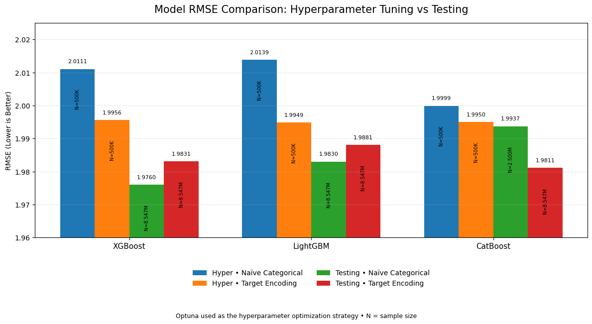
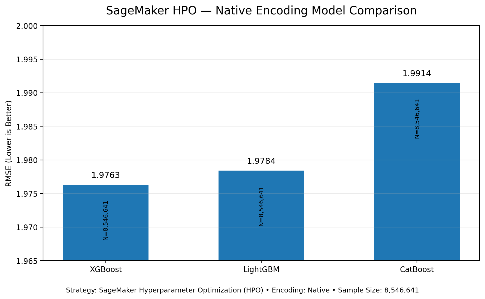
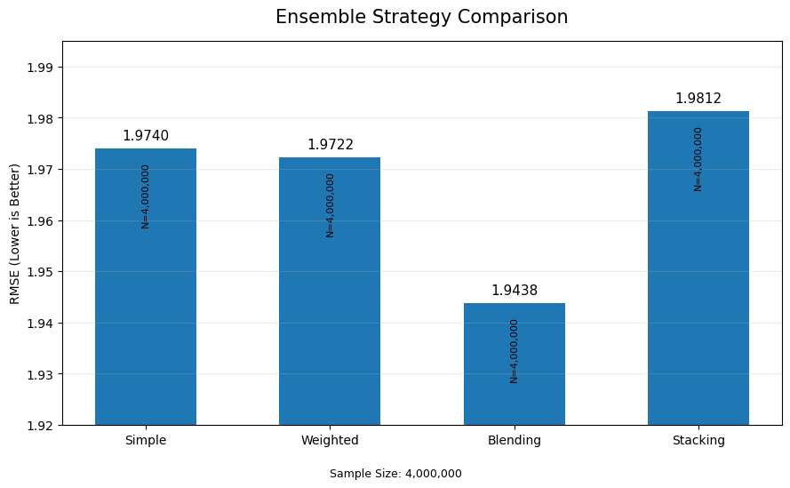
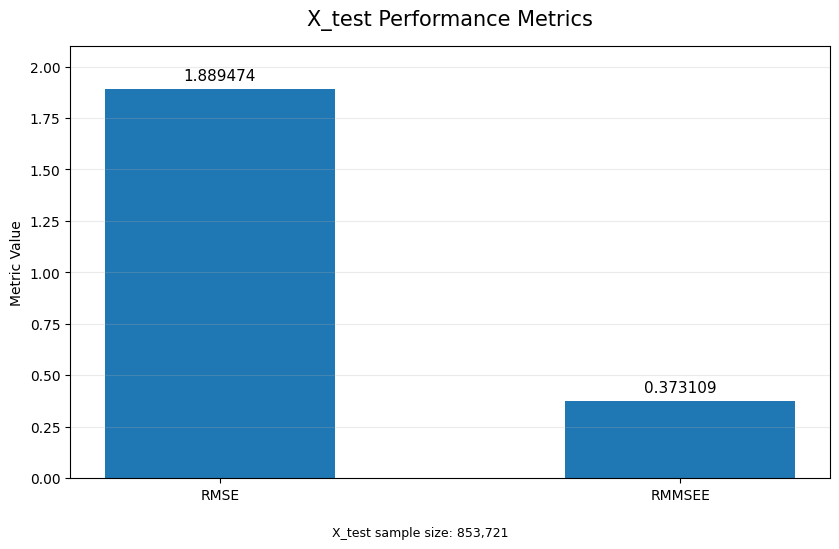
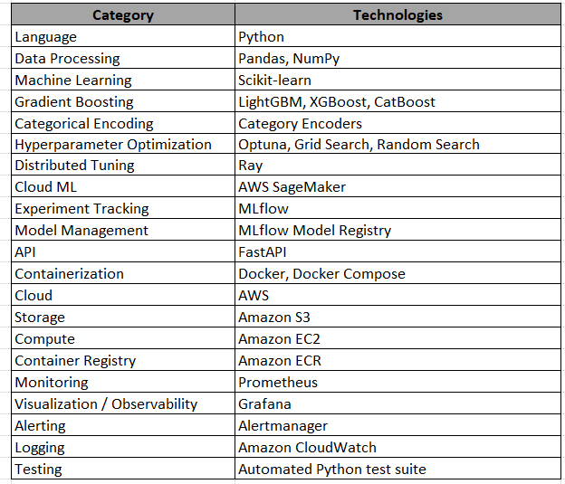

# Intelligent Demand Forecasting Platform

> An end-to-end, production-oriented machine learning and MLOps platform for demand forecasting, covering data ingestion, data validation, feature engineering, model development, model comparison, automated hyperparameter optimization, experiment tracking, model registry, recursive forecasting, API serving, AWS deployment, and production observability.

[](https://www.python.org/)
[](https://lightgbm.readthedocs.io/)
[](https://xgboost.readthedocs.io/)
[]
[](https://optuna.org/)
[](https://mlflow.org/)
[](https://fastapi.tiangolo.com/)
[](https://www.docker.com/)
[](https://aws.amazon.com/)
[](https://prometheus.io/)
[](https://grafana.com/)


## 🎯 Project Overview

Demand forecasting is a critical machine learning problem for organizations that need to anticipate future demand and make better decisions around inventory, supply, production, procurement, and operations.

This project implements an end-to-end demand forecasting platform that goes beyond model training and covers the complete machine learning lifecycle — from data ingestion and feature engineering to model optimization, production inference, cloud deployment, and monitoring.

### End-to-End ML Lifecycle

        ```text
    Data Ingestion
        ↓
    Data Processing & Validation
        ↓
    Feature Engineering
        ↓
    Feature Selection & Encoding
        ↓
    Model Training
        ↓
    Model Evaluation & Comparison
        ↓
    Hyperparameter Optimization
        ↓
    Experiment Tracking
        ↓
    Champion Model Selection
        ↓
    Model Registry
        ↓
    Recursive Forecasting
        ↓
    Production Inference API
        ↓
    Dockerized Deployment
        ↓
    AWS Deployment
        ↓
    Prometheus + Grafana Monitoring
        ↓
    CloudWatch Logging

## 🎯 Objectives

The main objectives of this project were:

    - Build a reusable demand forecasting pipeline.
    - Automate data ingestion and preprocessing.
    - Transform historical demand data into a machine-learning-ready dataset.
    - Engineer forecasting features suitable for tree-based models.
    - Evaluate multiple gradient-boosting algorithms.
    - Implement systematic model comparison.
    - Automate hyperparameter optimization.
    - Track experiments and model versions.
    - Select and manage a champion model.
    - Support recursive multi-step forecasting.
    - Expose forecasting functionality through an API.
    - Containerize the production inference service.
    - Deploy the inference workload to AWS.
    - Implement application and infrastructure observability.
    - Validate the system through automated tests.

## 🏗️ High-Level Architecture
                     ```text
                    ┌─────────────────────────────────────────────┐
                    │       MACHINE LEARNING DEVELOPMENT          │
                    │                                             │
                    │  Source Data                                │
                    │      ↓                                      │
                    │  Data Ingestion & Processing                │
                    │      ↓                                      │
                    │  Feature Engineering                        │
                    │      ↓                                      │
                    │  Model Development                          │
                    │  ┌──────────┬──────────┬──────────┐         │
                    │  │ LightGBM │ XGBoost  │ CatBoost │         │
                    │  └──────────┴──────────┴──────────┘         │
                    │      ↓                                      │
                    │  Hyperparameter Optimization                │
                    │  • Optuna                                   │
                    │  • Grid Search                              │
                    │  • Random Search                            │
                    │  • Ray + Optuna                             │
                    │  • SageMaker tuning                         │
                    │      ↓                                      │
                    │  Model Evaluation & Comparison              │
                    │      ↓                                      │
                    │  MLflow Experiment Tracking                 │
                    │      ↓                                      │
                    │  Champion Model Selection                   │
                    │      ↓                                      │
                    │  Model Registry                             │
                    └──────────────────────┬──────────────────────┘
                                           │
                                           ▼
                    ┌─────────────────────────────────────────────┐
                    │           PRODUCTION INFERENCE              │
                    │                                             │
                    │  Registered / Selected Model                │
                    │      ↓                                      │
                    │  Recursive Forecast Engine                  │
                    │      ↓                                      │
                    │  FastAPI Inference Service                  │
                    │  • /forecast                                │
                    │  • /health                                  │
                    │  • /metrics                                 │
                    │      ↓                                      │
                    │  Dockerized Production Service              │
                    │      ↓                                      │
                    │  AWS EC2                                    │
                    └──────────────────────┬──────────────────────┘
                                           │
                    ┌──────────────────────┴──────────────────────┐
                    │                                             │
                    ▼                                             ▼
       ┌──────────────────────────┐              ┌──────────────────────────┐
       │     CLOUD SERVICES       │              │      OBSERVABILITY       │
       │                          │              │                          │
       │ • Amazon S3              │              │ • Prometheus             │
       │ • Amazon ECR             │              │ • Grafana                │
       │ • Amazon SageMaker       │              │ • CloudWatch Logs        │
       │ • AWS IAM                │              │                          │
       └──────────────────────────┘              └──────────────────────────┘

## 🧠 Machine Learning Pipeline
    The machine learning pipeline is organized as a sequence of reusable components covering data ingestion, processing, feature engineering, model development, optimization, evaluation, and model lifecycle management.

🔽 1. **Data Ingestion**

    The project separates data ingestion from downstream machine learning components.

    The ingestion layer is responsible for bringing the required source data into the processing pipeline and preparing it for subsequent transformations.

    The repository contains dedicated ingestion and processing components under:
    
    ```text
    src_training/
    ├── ingestion/
    └── data_ingestion_processing_training/

    The production deployment also contains a separate ingestion/processing layer:

    ```text
    src_production_deployment/
    └── data_ingestion_processing/

    This separation allows training-time processing and production-time processing to evolve independently while maintaining a clear boundary between data acquisition and model inference.

🧹 2. **Data Processing & Validation**

    The preprocessing stage converts the ingested data into a consistent format suitable for machine learning.

    The pipeline includes processing and validation components for:

        - Data preparation
        - Data quality checks 
        - Schema check
        - Transformation
        - Validation
        - Production preprocessing
        - Forecast-input preparation

    Dedicated validation functionality exists across the training and production modules.
    The objective is to ensure that the data entering the model follows the expected schema and processing logic.

🛠️ 3. **Feature Engineering**

    Demand forecasting requires transforming historical observations into predictive signals.

    The project includes a dedicated feature engineering / processing layer that transforms the raw demand data into a supervised-learning representation.

    The feature engineering workflow is designed around forecasting-specific transformations rather than treating the problem as a generic tabular regression task.

    Key areas include:

        - Time-series feature construction
        - Historical demand information
        - Derived forecasting features
        - Categorical encoding
        - Numerical transformations
        - Feature selection
        - Production-consistent preprocessing

    The important architectural principle is:

    Raw Historical Data
            ↓
    Feature Engineering
            ↓
    Training Feature Matrix
            ↓
    Model

    and the same required transformations are reproduced during production inference.

    This helps prevent a common production ML problem where training and inference use different preprocessing logic.

🔤 4. **Encoding**

    Categorical variables are handled through a dedicated encoding layer.

    The repository contains:

    src_training/
    └── encoding/

    This keeps encoding logic separate from the model implementations and allows the preprocessing pipeline to remain reusable across different algorithms.

🤖 5. **Model Development**

    The platform evaluates multiple gradient-boosting algorithms rather than depending on a single model.

    Models implemented

    ***Model***	                      ***Role***
    LightGBM	             Primary gradient-boosting candidate
    XGBoost	                 Alternative gradient-boosting candidate
    CatBoost	             Alternative gradient-boosting candidate with strong categorical-data support
    Ensemble Models          Combines predictions from multiple candidate models to evaluate whether a combined approach 
                             can improve forecasting performance


    The project contains dedicated training and comparison components so that models can be evaluated using a consistent pipeline.

    src_training/
    ├── training/
    ├── comparator/
    ├── evaluation/
    └── ensemble/

📊 6. **Model Evaluation & Comparison**

    Model selection is based on measured validation performance rather than selecting a model purely by algorithm preference.

    The platform includes dedicated:

    Model evaluation
    Model comparison
    Validation
    Performance reporting
    Model selection 
    
    components.

    This makes it possible to compare candidate models under the same data-processing and evaluation framework.




### SageMaker HPO — Native Encoding



### Ensemble Model Performance



### Final X_test Performance



🔬 7. **Hyperparameter Optimization**

    One of the major components of this project is automated hyperparameter optimization.

    Instead of manually changing parameters and retraining models, the project provides multiple tuning strategies.

    Implemented approaches
    Grid Search
    Random Search
    Optuna
    Ray + Optuna
    SageMaker tuning

    The tuning framework is organized under:

    src_training/
    └── tuning/
        ├── hyperparameter_manager.py
        ├── parameter.py
        ├── parameter_space/
        ├── strategies/
        ├── ray/
        ├── tuning_pipeline.py
        ├── tuning_report.py
        └── visualization/

    This design separates:

    - Hyperparameter definitions
    - Search spaces
    - Optimization strategies
    - Tuning execution
    - Result reporting
    - Visualization

    from the actual model-training implementation.

    Why this matters?

    This makes the tuning framework extensible.

    For example, the same overall architecture can support:

    Model
      ↓
    Objective Function
      ↓
    Search Strategy
      ↓
    Trial
      ↓
    Training
      ↓
    Evaluation
      ↓
    Optimization

    without rewriting the complete training pipeline for every optimization method.

🧪 8. **Tuning Experiments**

        The repository includes persisted tuning results for multiple models and optimization approaches.

        Examples include:

        artifacts/tuning_report/
        ├── catboost/
        │   ├── optuna_results.csv
        │   └── sagemaker_results.csv
        │
        ├── lightgbm/
        │   ├── grid_search_results.csv
        │   ├── optuna_results.csv
        │   ├── random_search_results.csv
        │   ├── ray_optuna_results.csv
        │   └── sagemaker_results.csv
        │
        └── xgboost/
            ├── optuna_results.csv
            └── sagemaker_results.csv

        The project also stores interactive tuning visualizations:

        artifacts/tuning_visualization/

        including:

        - Optimization history
        - Parameter importance
        - Parallel coordinates
        - Slice plots
        - Contour plots

        These artifacts make the optimization process inspectable rather than treating hyperparameter tuning as a black box.

⚡ 9 **Optuna & Pruning**

    Optuna is used for automated hyperparameter search.

    The tuning implementation also supports pruning so that underperforming trials can be stopped early instead of consuming resources unnecessarily.

    This is especially useful when the search space contains many combinations and some configurations clearly perform poorly.

🚀 10. **Ray-Based Optimization**

    The project also contains Ray-based tuning examples and a Ray + Optuna strategy.

    This provides an additional path for distributing hyperparameter search when experimentation needs to scale beyond a single sequential optimization process.

    Relevant components include:

    src_training/tuning/ray/
    experiments/ray_tun

☁️ 11. **SageMaker Integration**

    The platform also includes SageMaker-oriented tuning/deployment functionality.

    This allows experimentation to extend from local development into AWS-managed ML infrastructure.

    The repository contains:

    Dockerfile_sage

    as well as SageMaker-related training/deployment code and configuration.

    This provides a path for moving computationally intensive experimentation toward managed cloud infrastructure.

📈 12. **MLflow Experiment Tracking**

    MLflow is used to bring experiment management into the training workflow.

    The project contains a dedicated MLflow module:

    src_training/
    └── mlflow/

    MLflow is used to organize and track model-development experiments, including the information required to compare candidate runs.

    This gives the project a reproducible experiment-management layer instead of relying exclusively on notebooks or manually maintained spreadsheets.

🏆 13. **Champion Model & Model Registry**

    Once models have been trained and evaluated, the platform provides a mechanism for identifying and managing the selected model.

    The repository contains:

    src_training/
    ├── registry/
    └── champion_model_download.py

    The model registry layer separates model development from production deployment.

    Conceptually:

    Candidate Models
        ↓
    Evaluation
        ↓
    Best / Champion Model
        ↓
    Model Registry
        ↓
    Production Inference

    This separation makes it possible to update the production model without tightly coupling production serving to the training process.

🔁 14. **Recursive Forecasting**

    A major component of the project is recursive forecasting.

    Instead of training a completely independent model for every future time step, the system can use a previous prediction as an input for subsequent predictions.

    Conceptually:

    Historical Data
        ↓
    Predict t+1
        ↓
    Add prediction to input history
        ↓
    Predict t+2
        ↓
    Add prediction to input history
        ↓
    Predict t+3
        ↓
    ...

    The recursive forecasting implementation is available through:

    src_training/recursive_prediction_aws.py

    and the production deployment contains corresponding recursive forecasting functionality.

    This required careful handling of:

    Forecast state
    Feature reconstruction
    Historical windows
    Prediction chaining
    Production preprocessing
    Output generation

🏭 15. **Production Inference Architecture**

    The project separates the training environment from the production inference environment.

    Training
    ────────────
    src_training/

    Production
    ────────────
    src_production_deployment/

    The production side contains:

    src_production_deployment/
    ├── configs/
    ├── data_ingestion_processing/
    ├── logger/
    ├── production_deployment/
    ├── prometheus/
    └── utils/

    This separation keeps the production service focused on inference rather than carrying the entire experimentation stack.

🌐 16. **FastAPI Forecasting Service**

    The trained model is exposed through an API-based inference layer.

    The production service provides forecasting functionality through FastAPI and includes health and metrics endpoints.

    The Docker Compose configuration exposes the API on:

    http://localhost:8000

    and includes a health check against:

    /health

    This makes the service suitable for containerized deployment and operational monitoring.

🐳 17. **Docker & Containerization**

    The production application is containerized using Docker.

    The repository contains:

    Dockerfile
    Dockerfile_sage
    docker-compose.yml

    Docker Compose is used to coordinate the application and observability services.

    The local stack includes:

    API
    Prometheus
    Grafana

    The API container is configured with a health check so that container orchestration can determine whether the service is healthy.

☁️ 18. **AWS Deployment**

    The project was deployed to AWS as part of the productionization work.

    AWS components used in the project include:

    Amazon EC2
    Amazon S3
    Amazon SageMaker
    AWS IAM
    Amazon CloudWatch
    Amazon ECR

    The production architecture uses AWS services for:

    Cloud compute
    Artifact/model storage
    Managed ML experimentation/deployment
    IAM-based access control
    Container image management
    Application logging

🔐 19. **AWS IAM & Security**

    AWS access is implemented using IAM roles and policies rather than embedding cloud credentials directly into the application.

    The project contains AWS policy and role configuration files for the required services.

    The local Docker setup also mounts the AWS configuration directory read-only when AWS access is required.

    Secrets and environment-specific credentials are intentionally excluded from source control.

🧠 20. **SageMaker**

    SageMaker is integrated into the experimentation/deployment workflow for cloud-based ML operations.

    The project includes:

    src_training/test_sagemaker_deployment.py

    and SageMaker-specific configuration and deployment components.

    This provides an alternative to performing all training/tuning workloads locally.

📊 21. **Monitoring with Prometheus**

    The inference service exposes application metrics that can be scraped by Prometheus.

    The project includes:

    src_production_deployment/
    └── prometheus/
        ├── prometheus.yml
        ├── recording_rules.yml
        └── alertmanager.yml

    The application tracks forecasting-service metrics such as:

    Request counts
    Success/error status
    Request duration
    Forecast request behavior

    This provides visibility into application health and service performance.

📈 22. **Grafana Observability**

    Grafana is used to visualize the Prometheus metrics.

    The Docker Compose stack includes Grafana alongside Prometheus:

    API
    ↓
    Prometheus
    ↓
    Grafana

    This allows operational metrics to be converted into dashboards for easier monitoring.

    The project also includes persistent Grafana storage through Docker volumes.

🚨 23 **Alerting**

    The Prometheus configuration includes Alertmanager configuration:

    src_production_deployment/prometheus/alertmanager.yml

    This provides the foundation for operational alerting based on application/monitoring conditions.

☁️ 24. **CloudWatch Logging**

    The production Docker deployment also integrates AWS CloudWatch logging.

    The API container can use the AWS logs Docker logging driver so application logs can be centralized in CloudWatch.

    This creates a separation between:

    Metrics
    → Prometheus → Grafana

    Logs
    → CloudWatch

    providing both metrics-based observability and centralized application logging.

🧪 25. **Testing**

    Testing is treated as part of the engineering workflow rather than being limited to model notebooks.

    The repository contains:

    tests/

    as well as testing utilities within the training and deployment modules.

    Examples include:

    src_training/testing.py
    src_training/test_sagemaker_deployment.py

    and production/inference-related tests.

    The testing layer helps validate:

    Data-processing behavior
    Model-related functionality
    Forecasting logic
    Deployment integration
    Service behavior

🔄 26. **End-to-End ML Lifecycle**

        The complete lifecycle implemented in the project can be summarized as:

        1. Ingest
        ↓
        2. Process
        ↓
        3. Validate
        ↓
        4. Engineer Features
        ↓
        5. Encode / Select Features
        ↓
        6. Train Candidate Models
        ↓
        7. Evaluate Models
        ↓
        8. Tune Hyperparameters
        ↓
        9. Compare Experiments
        ↓
        10. Select Champion Model
        ↓
        11. Register Model
        ↓
        12. Prepare Recursive Forecasting
        ↓
        13. Deploy Inference API
        ↓
        14. Containerize
        ↓
        15. Deploy to AWS
        ↓
        16. Monitor with Prometheus/Grafana
        ↓
        17. Centralize Logs with CloudWatch

        This is the core reason the project is positioned as a platform rather than a standalone forecasting notebook.

## 🧩 **Design Principles**

    The project follows several engineering principles.

        1. Separation of concerns

           - Training, tuning, evaluation, registry, and production inference are separated into dedicated modules.

        2. Configuration-driven experimentation

           - Hyperparameter configurations are stored separately from training code.

        3. Pluggable tuning strategies

           - Different optimization strategies can be selected without rewriting the entire training pipeline.

        4. Reusable preprocessing

            - Production preprocessing is separated from research experimentation so inference can reproduce the required transformations.

        5. Model lifecycle management

            - Model evaluation, champion selection, registry, and deployment are treated as separate lifecycle stages.

        6. Observability by design

            - The production service exposes metrics and integrates with centralized logging.

        7. Cloud-ready architecture

            - The system supports AWS-based storage, compute, managed ML services, and monitoring.

## 🛠️ **Technology Stack**



## 🧠 **What Makes This Project Different?**

        This project is intentionally designed to demonstrate more than model accuracy.

        It covers the complete lifecycle

            Research
                ↓
            Experimentation
                ↓
            Optimization
                ↓
            Model Management
                ↓
            Productionization
                ↓
            Cloud Deployment
                ↓
            Monitoring

        It separates training from inference/ The production environment does not need to contain the entire experimentation stack.

        It supports multiple optimization strategies. Rather than depending on a single hyperparameter optimizer, the architecture supports multiple search approaches.

        It includes real operational concerns

        The project addresses:

            - API health
            - Request metrics
            - Error monitoring
            - Request latency
            - Centralized logs
            - Cloud deployment
            - IAM
            - Containerization
            - Model lifecycle management


## 🔮 **Future Improvements**

    Potential future enhancements include:

    - CI/CD automation for training and deployment
    - Automated model retraining workflows
    - Data drift monitoring
    - Model drift monitoring
    - Automated model promotion based on validation criteria
    - Feature-store integration
    - Distributed training at larger scale
    - API authentication and authorization
    - Kubernetes-based orchestration
    - Automated integration testing in CI
    - Advanced forecasting ensembles
    - Automated model performance dashboards

## 📚 **Project Learning Outcomes**

    This project provided hands-on implementation across the complete machine learning lifecycle:

    - Data engineering
    - Time-series feature engineering
    - Supervised learning for forecasting
    - Gradient boosting
    - Feature selection
    - Model comparison
    - Hyperparameter optimization
    - Distributed experimentation
    - MLflow
    - Model registry
    - Recursive forecasting
    - API development
    - Docker
    - AWS
    - IAM
    - S3
    - SageMaker
    - ECR
    - EC2
    - CloudWatch
    - Prometheus
    - Grafana
    - Alertmanager
    - Testing
    - Production ML architecture
    
    👨‍💻 Author

    Chetan Fernandes

    GitHub:
    https://github.com/ChetanFernandes

    Project:
    https://github.com/ChetanFernandes/intelligent-demand-forecasting-platform

## ⭐ **Summary**

    The Intelligent Demand Forecasting Platform demonstrates how a machine learning forecasting solution can be developed as a complete production-oriented system rather than as an isolated notebook.

    It combines:

    Data Engineering → Feature Engineering → Machine Learning → Hyperparameter Optimization → Experiment Tracking → Model Registry → Recursive Forecasting → API Serving → Docker → AWS → Monitoring → Logging

    The project is intended as a practical demonstration of building and operationalizing an end-to-end machine learning forecasting platform.
